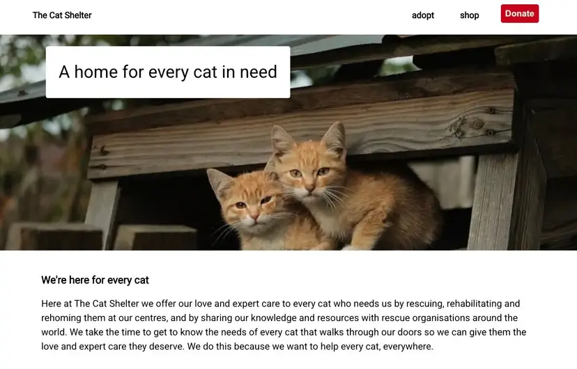

<p align="center">
    
</p>

# 🐱 Cat Shelter App

A responsive web application for browsing, managing, and showcasing cats available for adoption, as well as an online shop.

Built as a portfolio project to explore static site generation, data-driven UI, and component-based architecture using Gatsby.

🚀 Live Demo https://helenas-cat-shelter.netlify.app/

## Learning & Application

This project was built to consolidate and apply skills developed during my time at Shelter in an independent setting.

It focuses on translating real-world experience into a structured, component-driven application using Gatsby and Contentful.

Key areas:

- Building reusable, maintainable React components
- Structuring content using a headless CMS (Contentful)
- Working with Gatsby’s data layer and GraphQL
- Creating performant static sites with clear separation of data and presentation

## 🛠️ Tech Stack

- Framework: Gatsby
- Language: JavaScript / React
- Styling: Styled Components
- Testing: Jest and RTL
- Data: Contentful + GraphQL

## Project Structure

```
├── src/
│   ├── components/     # Reusable UI components
│   ├── pages/          # Gatsby pages (routing)
│   ├── templates/      # Page templates (if used)
│   └── data/           # Data sources (if applicable)
├── gatsby-config.js    # Site configuration
├── gatsby-node.js      # Node APIs (if used)
└── package.json
```

## ⚙️ Getting Started

### ⚠️ This project relies on Contentful for content data.

If you don’t provide valid credentials, the site will not render content locally.

A live demo is available if you prefer not to set up the CMS locally: https://helenas-cat-shelter.netlify.app/

If you have access to the correct Contentful enviroment, follow these intructions:

### 1. Clone the repository

```bash
git clone https://github.com/HelenaAgustsson/cat-shelter-gatsby.git
cd cat-shelter-gatsby
```

### 2. Install dependencies

```
npm install
```

### 3. Set up Contentful

Run the setup script:

```
npm run setup
```

This will:

- prompt you for your Contentful Space ID
- ask for Management API and Delivery API tokens
- import the required content model
- generate a .contentful.json config file
